# whizwheel — Intelligence & Context Flow

**Status:** Living document, maintained by the PM agent. **Derived** — every claim here is read
from `CLAUDE.md` and each `.claude/agents/*.md` launch protocol, not invented. This map exists
because **context engineering is the heart of the experiment.** whizwheel is built by *iterating
on agent definitions*, and the central design variable is **who inherits what, and when** — which
documents each agent reads at launch, which it reads on demand, which it deliberately does **not**
read, and whether it runs with a fresh isolated context or an inherited one. A single diagram +
table makes that design **inspectable**: it onboards a human fast and surfaces gaps (an agent
missing a doc it should read, or carrying one it shouldn't).

The load-bearing facts, stated once:

- **`CLAUDE.md` is the shared contract** — but **subagents do not auto-inherit it.** Every agent
  reads it as its first action (Step 0); the orchestrator must point each dispatched subagent at
  it. The contract is shared by *convention and re-reading*, not by automatic inheritance.
- **`JOURNEY.md` is main-thread-only.** Subagents do **not** read it (except the `historian`, whose
  whole job is to *write* it). It would waste a worker's context on the saga it doesn't need.
- **Build agents ingest `ARCHITECTURE.md` + `PRODUCT.md`; UI builds also ingest `DESIGN.md`.**
  `backend` deliberately does **not** read `DESIGN.md`; `frontend` deliberately does **not** read
  calculator math; `database-agent` reads neither `DESIGN.md` nor `JOURNEY.md`.
- **Report-only agents create no worktree** (`ci-monitor`, `dependabot-agent`, `database-agent`);
  every *writing* agent creates its own worktree as its first action and lands work via PR.

---

## Part 1 — The context-flow diagram

Knowledge sources flow **into** agents (reads); agents flow **out** to artifacts (produces).
Subgraphs group the three planes. Edge styling distinguishes the two read modes:

- **Solid edge** = **read at launch** (the agent's Step 0 / launch protocol — always, every invocation).
- **Dotted edge** = **read on demand** (only when the task needs it — a spec, CI logs, the DB, etc.).
- **Thick edge** = **produces** (agent → artifact).

The main-thread orchestrator is styled distinctly because it is the **only** node that inherits
context across the session and reads `JOURNEY.md`; every subagent is a **fresh, isolated context**.

```mermaid
flowchart TD
  subgraph SRC["Knowledge sources"]
    CLAUDE["CLAUDE.md<br/>(shared contract)"]
    ARCH["docs/ARCHITECTURE.md"]
    PROD["docs/PRODUCT.md"]
    DESIGN["docs/DESIGN.md (BLEND)"]
    INV["docs/INVENTORY.md"]
    JOURNEY[("JOURNEY.md<br/>main-thread-only")]
    SPEC["Calculator spec<br/>= GitHub issue body (spec:v1)"]
    ENV["JSON envelope<br/>(ARCHITECTURE §4)"]
    STRUCT["db/structure.sql + app/models"]
    CILOGS["CI run + failed-job logs"]
    SHOTS["CI screenshots / canvas pixels"]
    CHANGELOG["Dependency changelogs"]
  end

  subgraph AGENTS["Agents"]
    ORCH{{"MAIN-THREAD ORCHESTRATOR<br/>(inherited context)"}}
    PM["project-manager-agent<br/>(isolated)"]
    BE["backend<br/>(isolated)"]
    FE["frontend<br/>(isolated)"]
    CI["ci-monitor<br/>(isolated, report-only)"]
    HIST["historian<br/>(isolated)"]
    DB["database-agent<br/>(isolated, report-only)"]
    DEP["dependabot-agent<br/>(isolated, report-only)"]
  end

  subgraph OUT["Outputs / artifacts"]
    PRS["Pull Requests"]
    ISSUES["GitHub Issues<br/>(backend/frontend/engineering/agents)"]
    DOCS["docs/ (inventory, logs, vision)"]
    JOUT["JOURNEY.md"]
    REPORTS["Status reports / verdicts"]
  end

  %% ---- reads at launch (solid) ----
  CLAUDE --> ORCH
  JOURNEY --> ORCH

  CLAUDE --> PM
  CLAUDE --> BE
  CLAUDE --> FE
  CLAUDE --> CI
  CLAUDE --> HIST
  CLAUDE --> DB
  CLAUDE --> DEP

  ARCH --> BE
  PROD --> BE
  ARCH --> FE
  PROD --> FE
  DESIGN --> FE
  ARCH --> DB

  %% ---- reads on demand (dotted) ----
  ARCH -.-> PM
  PROD -.-> PM
  INV -.-> PM
  SPEC -.-> PM
  SPEC -.-> BE
  ENV -.-> BE
  SPEC -.-> FE
  ENV -.-> FE
  STRUCT -.-> DB
  JOURNEY -.-> HIST
  CILOGS -.-> CI
  SHOTS -.-> ORCH
  CHANGELOG -.-> DEP

  %% ---- produces (thick) ----
  PM ==> ISSUES
  PM ==> DOCS
  BE ==> PRS
  FE ==> PRS
  HIST ==> JOUT
  CI ==> REPORTS
  DB ==> REPORTS
  DEP ==> REPORTS
  ORCH ==> REPORTS

  classDef orchestrator fill:#1f6feb,stroke:#0b3d91,color:#ffffff;
  classDef reportonly stroke-dasharray: 4 3;
  class ORCH orchestrator;
  class CI,DB,DEP reportonly;
```



**How to read it:**
- Solid arrows into `BE`/`FE` show the always-read trio (`CLAUDE.md`, `ARCHITECTURE.md`,
  `PRODUCT.md`) — plus `DESIGN.md` into `FE` only.
- The dotted spec arrows (`SPEC -.-> BE/FE`) are the per-task read: a calculator's spec is its
  GitHub issue body, fetched for the specific build.
- `JOURNEY.md` has a **solid** edge only to the orchestrator and a **dotted** edge only to the
  `historian` — no other agent touches it.
- Report-only agents (dashed border) emit **reports/verdicts**, never PRs, issues, or docs.

---

## Part 2 — Who knows what, when

One row per agent. Every cell is pulled from that agent's actual definition; "deliberately does
NOT read" lists exclusions the definition states explicitly.

| Agent | Context | Reads at launch (Step 0) | Reads on demand | Deliberately does NOT read | Produces |
|---|---|---|---|---|---|
| **main-thread orchestrator** | **Inherited** (the live session; persists across turns) | `CLAUDE.md`; **`JOURNEY.md`** at the start of a fresh session | CI screenshots via `bin/ci-screenshots` for the visual gate; whatever the task surfaces | — (it orchestrates; subagents do the reading) | Dispatches subagents; runs the **visual gate**; merges PRs on human instruction; status to the user |
| **project-manager-agent** | **Isolated** (fresh subagent; full re-ingestion every launch) | `CLAUDE.md`, then **every file under `docs/` in full**; full git/issue/PR state (`git log`, `gh issue list`, `gh pr list`) | calculator.net (WebFetch) for inventory + reference values; `ARCHITECTURE.md §3.2` for spec format | **`JOURNEY.md`** (subagent — not read); app code & agent definitions except to read for description | `docs/` (inventory, iteration logs, `PRODUCT.md` stewardship); **GitHub Issues** (creates/labels, never closes); iteration tags; doc PRs |
| **backend** | **Isolated** (fresh subagent; one calculator/task per invocation) | `CLAUDE.md`, `docs/ARCHITECTURE.md`, `docs/PRODUCT.md`, then the **spec** + `app/calculators/base.rb` | the calculator's spec via `gh issue view`; any backend file the task needs | **`docs/DESIGN.md`** (explicitly not its concern); **`JOURNEY.md`**; client-side code (it may read but never writes it) | server-side code (`app/calculators/`, controllers, models, `db`, `lib`, jobs, routes) + tests; a **PR** (`Closes #N`); the JSON envelope (`§4`) |
| **frontend** | **Isolated** (fresh subagent; one page/task per invocation) | `CLAUDE.md`, `docs/ARCHITECTURE.md` (esp. **§4** the envelope), `docs/PRODUCT.md`, `docs/DESIGN.md` | the calculator's spec (modes/inputs/output keys); the JSON envelope as the only backend contract | **calculator math / models / controller business logic / migrations / routes** (never written); **`JOURNEY.md`** | UI code (`app/views`, `app/helpers`, `app/assets`, Stimulus) + tests; system tests + **screenshots**; a **PR** (`Closes #N`) |
| **ci-monitor** | **Isolated** (report-only; **no worktree**) | `CLAUDE.md` | the CI run + failed-job logs via `bin/ci-watch` (its only tool) | the app docs (`ARCHITECTURE`/`PRODUCT`/`DESIGN`); **`JOURNEY.md`** | a **PASS/FAIL/NO-RUN verdict** + root-cause diagnosis; writes nothing, merges nothing |
| **historian** | **Isolated** (fresh subagent; usually fired in background) | `CLAUDE.md` | **`JOURNEY.md`** (fully — its coverage anchor); the **session transcript** (`.jsonl`); `git log` | the app docs (`ARCHITECTURE`/`PRODUCT`/`DESIGN`) — not needed for the saga | **`JOURNEY.md`** only (new chapters), via a docs PR; a transcript snapshot (gitignored) |
| **database-agent** | **Isolated** (report-only; **no worktree**) | `CLAUDE.md`, `docs/ARCHITECTURE.md` (§0/§5/§6/§7–8), `db/structure.sql`, `app/models/` | the live schema census + read-only queries (`bin/rails runner`, `dbconsole`/`psql`) | **`docs/DESIGN.md`** and **`JOURNEY.md`** (both explicitly excluded) | a **read-only DB report** (counts, mode coverage, attribution); never mutates data or schema |
| **dependabot-agent** | **Isolated** (report-only; **no worktree**) | `CLAUDE.md` | per-PR diff + CI (`bin/ci-watch`); dependency **changelogs** (WebFetch) | the app docs; **`JOURNEY.md`** (explicitly "you do not need" them) | a **per-PR verdict** (GREEN-LANE / NEEDS-HUMAN); its one write-action is posting `@dependabot rebase` on a stale PR |

**Patterns worth noting:**
- **Everyone reads `CLAUDE.md` at launch; no one inherits it automatically.** Re-reading is the
  inheritance mechanism for subagents.
- **Only the main thread reads `JOURNEY.md` for context; only the historian writes it.** Every
  other agent is deliberately blind to it.
- **`DESIGN.md` is frontend-only.** `backend` and `database-agent` exclude it by name.
- **Report-only agents** (`ci-monitor`, `dependabot-agent`, `database-agent`) create **no worktree**
  and produce **reports/verdicts only** — never PRs, issues, or docs.
- **Writing agents** (`project-manager-agent`, `backend`, `frontend`, `historian`) each create their
  **own worktree** as a first action and land work via **PR** (never push to `main`, never merge).

---

## Appendix — the agents against the app's runtime pipeline

The agent/context map above is the core. For end-to-end legibility, here is where each *build*
agent's output sits relative to the app's own request pipeline (`ARCHITECTURE.md §1, §4`):

```
request → CalculatorsController → Calculators::X (pure math) → JSON envelope → view
          └── backend ─────────────────────────────────────┘   │   └── frontend ──┘
                                                          the seam (§4)
```

- **`backend`** owns everything **server-side of the route**: the controller, `Calculators::X`
  (pure math), persistence, and the **JSON envelope** that is the contract.
- **`frontend`** owns everything **client-side of the route**: it codes the **view** against that
  same envelope and the BLEND tokens — nothing else.
- The **JSON envelope (§4)** is the seam: the one artifact both build agents share, which is why
  both carry the *same* `spec:v1` body (modes, inputs, output keys) even though they read it for
  different ends.

---

> **Derived doc — refresh when agent definitions change.** This map is read from `CLAUDE.md` and
> the `.claude/agents/*.md` launch protocols; it goes stale the moment one of those changes. When an
> agent's reading list, context model, or output set is edited — typically in an iteration's
> **harvest** phase (`CLAUDE.md` → Iteration delivery lifecycle) — update this file in the same pass,
> or it silently lies about who-knows-what.
